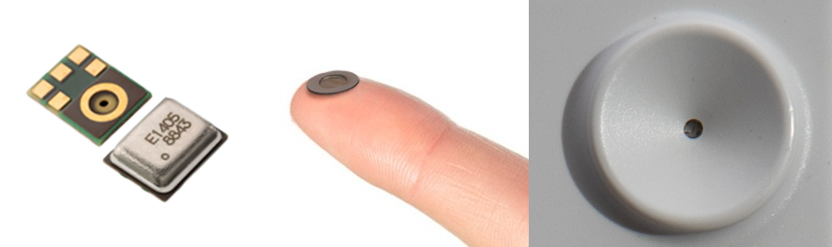

# Audio

## Recording cycle

By default, Bugg is designed to record compressed MP3 audio files continuously (24/7) without breaks between recordings. 

Bugg runs concurrent threads to handle simultaneous recording and compressing/uploading of audio data. If enabled, compression begins immediately after the audio file has finished recording. To manage CPU load, [server uploads](connectivity.md) are always begun out-of-sync with the audio recording loop.

The default recording cycle behaviour (300s files, compression enabled) is depicted below:

{align=left, width=100%}

Many of Bugg's audio recording parameters (e.g., sampling rate, gap between files, compression) can be modified through the [configuration file](config.md#audio-recording-parameters). 

A modified configuration, which called for 60s uncompressed audio files separated by 140s gaps, would result in the below cycle:

{align=left, width=100%}

Currently, there is no option to record only certain hours of the day (e.g., focussed at dawn or dusk). Whilst it is possible to implement this feature in software through modifications to the [firmware](advanced.md#modifying-the-firmware), the idling power draw of the Raspberry Pi CM4 is relatively high so this would not result in significant overall power savings. 

## MP3 compression

If compression is enabled, Bugg uses [FFMPEG's](https://trac.ffmpeg.org/wiki/Encode/MP3) highest quality variable bit rate (VBR) MP3 compression (220-260 kb/s). 

We have found, for a wide range of eco-acoustic data, this compression scheme produces approximately 1.2 GB of audio data per day per device (at 44.1 kHz sampling rate).

Please note that since MP3 uses perceptual audio coding (i.e., is tuned to the frequencies that humans are most sensitive to) it will not work for ultrasonic data.

Other compression schemes have not yet been implemented, but for those able to [modify firmware](advanced.md#modifying-the-firmware) it should be relatively straightforward to try alternatives.  

## Hardware

Bugg can record audio from either the integrated microphone, or (in v2) from an external microphone connected through the M12 connector. The choice of audio recording interface is set through the [configuration file](config.md).

### Integrated microphone

A MEMs microphone is integrated into each Bugg device, which is weatherproofed by an acoustic vent and interfaced through a horn on the device enclosure.

{align=left, width=100%}

#### Knowles SPH0641LU4H-1 

The integrated microphone in Bugg is a [Knowles SPH0641LU4H-1](https://www.digikey.co.uk/en/products/detail/knowles/SPH0641LU4H-1/5332438) PDM microphone. 

Full specifications are in the microphone's [documentation](https://mm.digikey.com/Volume0/opasdata/d220001/medias/docus/930/SPH0641LU4H-1.PDF), but a few key details are:

* Omnidirectional
* Supported sampling frequencies: 100 Hz - 80 kHz
* Sensitivity: -26dB ±1dB @ 94dB SPL
* Signal to noise ratio: 64.3dB

#### Acoustic membrane  
Between the microphone and the outside world is a breathable ePTFE membrane (similar to [GORE MEMS Protective Vents](https://www.gore.com/products/gore-mems-protective-vents)). 

Whilst the aim of this vent is to be acoustically transparent, in reality it will still attenuate recorded acoustic signals slightly. Nonetheless, it is required for weatherproofing as any water ingress into the Knowles microphone is likely to result in a total device failure.   

#### Microphone horn

The Bugg enclosure has a slight horn around the hole for the integrated microphone. This is primarily to amplify acoustic signals, however it comes at the cost of increased directionality of recordings. 

For an excellent deep dive into the topic of microphone design for eco-acoustic applications, see [Darras et al. 2018](https://doi.org/10.12688/f1000research.17511.3){:target="_blank"}.

### External microphones

Coming soon..!
