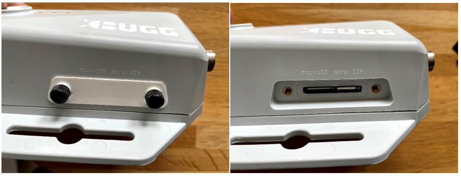
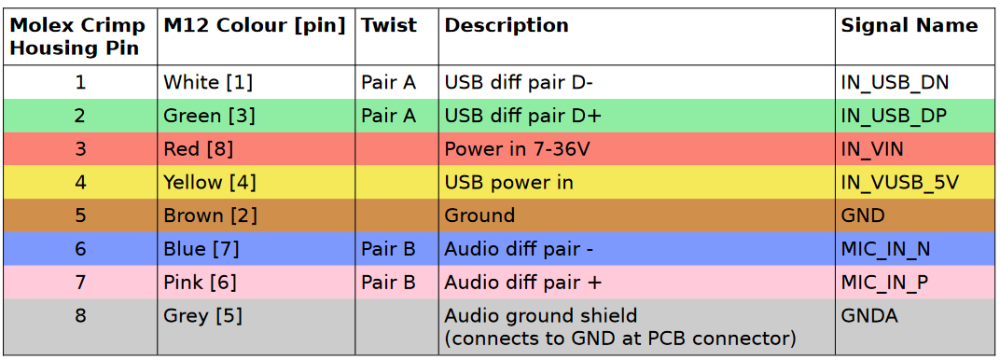

# Hardware 

## Overview

Bugg's key exterior features are annotated below:

{align=left, width=50%}{align=right, width=50%} 

## Mounting Bugg

Bugg can be mounted in the environment using the mounting wings, by following one of the two recommended approaches:

* Thread a flat strap through slots, across the back of the device, and tie it around a suitable feature in the environment (e.g., a tree trunk) 
* Use the screw heads to bolt the device firmly to a flat surface (e.g., a wall) 

{align=left, width=100%}

Of course, if required, other more creative approaches might be required. In this case, please be careful to **not obscure the microphone** with any mounting hardware to ensure Bugg is able to capture the best audio quality possible.

## Side door

To insert or replace the microSD or nano SIM cards, undo the two thumbscrews on the side of the device to remove the white side door.

{align=left, width=100%}

Both cards should be inserted with the metal contacts facing downwards. Push the cards firmly into their respective slots until you feel a click.

To remove the cards, push the cards into the device until you hear a click, then release and they will push themselves partly out of the device. You can then pull them out fully easily by hand.  

## M12 connector

Through a waterproof M12 connector at the bottom of Bugg, the device is able to receive [power](power.md), connect to an [external microphones](audio.md#external-microphones), or expose a [debugging](advanced.md) interface.

### Connecting a cable 

To connect a Bugg to an M12 male cable (e.g., for power):

* Align the M12 male connector on the cable with the female M12 connector on Bugg
* Push the two connectors together firmly
* Screw the cable connector fully into the Bugg connector by rotating the appropriate part until there are no threads visible 

{align=left, width=100%}

In the above image, the knurled ring is used to screw the two connectors together. However, the exact rotating part may vary between cable batches. Please do not skip this step, as otherwise the cable will easily fall out and the connection will not be waterproof. 

### Pinout

The full pinout of the Bugg M12 interface is provided below. 

{ width="100%" }

## Status LEDs

Bugg communicates its status through three RGB LEDs on the front of the device, situated below the microphone. From top to bottom, the LEDs correspond to **recording**, **connectivity**, and **power**, respectively.

When Bugg is booting, the LEDs will turn on sequentially from bottom to top, starting with just the power LED (left image below). It may take minutes for all the recording LED to activate (right panel), so please be patient.

{ width="100%" }

### Recording LED

The recording LED tells you whether Bugg is recording audio or not. 

It can be in two states:

* **Green**: Recording audio
* **Off**: Not recording audio

### Connectivity LED

The connectivity LED tells you whether Bugg has a valid [internet connection](connectivity.md) or not.

There are four states:

* **Blue**: Successfully connected to internet 
* **Cyan**: Data being uploaded
* **Red**: No internet connection 
* **Off**: Device booting, modem not active yet

On boot, the connectivity LED will often start red as Bugg attempts to establish an internet connection, then turn blue if successful. This can take minutes, so please be patient.  

### Power LED

The power LED tells you whether Bugg is connected to a power source. It can be in two states:

* **Red**: Receiving power
* **Off**: Not receiving power

### LED error state

If the device encounters an unexpected error, **all three LEDs** will **flash white** together until the device is powered down. When Bugg is in this error state, no data is recorded. 

These errors are rare and could indicate faulty hardware, microSD cards, or power connectors. For those with sufficient technical know-how, [advanced](advanced.md) debugging options are available. 

