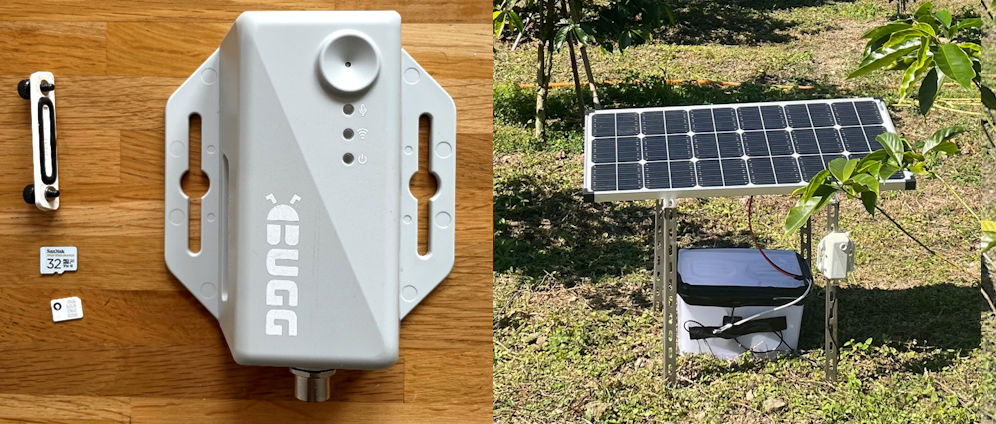

# Quick start

{ width="100%" }

## Equipment 

First, make sure you have all the required equipment:

* Bugg device and power cable
* MicroSD card
* Power source (5-36V DC, e.g., from mains or renewables)
* Nano SIM with [mobile internet](connectivity.md)

## Deployment

Then, set up and deploy a device with the following steps:

1. Set up a microSD card with your Bugg [configuration](config.md)
1. Put the SD card and a SIM into the [device](hardware.md#ports-and-interfaces)
1. Connect Bugg to a [power source](power.md)
1. Wait for the Bugg to boot and check the [status lights](hardware.md#status-lights)
1. Check your [server](connectivity.md) for real-time audio data

To run a Bugg fully [offline](connectivity.md#offline-mode) (e.g., where there is no mobile coverage), simply leave the nano SIM slot empty and audio will be recorded locally to the micro SD card. 

